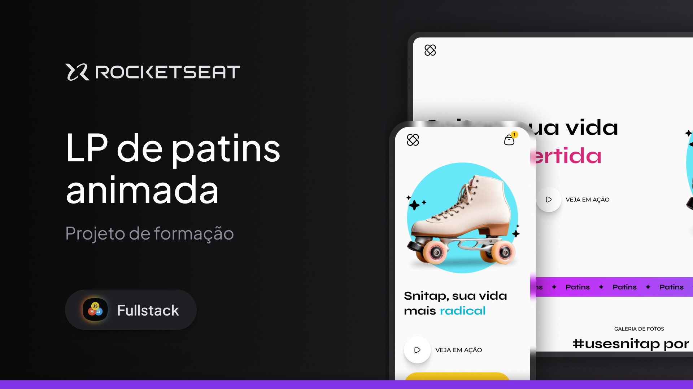

<h1 align="center">🛼 Skates Sales Landing Page</h1> 

 Project developed during the <strong>Rocketseat Full-Stack Program</strong>.  Focused on animations, smooth transitions and responsive design. 

  
  
  Design by <a href="/ilanamallak">Ilana Mallak</a> 

🚀 Technologies Used

- HTML5 — Semantic page structure
- CSS3 — Styling, animations, transitions and responsiveness
- Git & GitHub — Version control
- Figma — UI prototype and design reference

🖥️ Sobre o Projeto

This project is a fully responsive marketing landing page for a skate e-commerce website, developed with a strong focus on user experience and visual impact.
The main goal was to apply modern front-end concepts, especially in:

✨ Animations

- Elements animated when entering the viewport
- Subtle motion effects to create visual hierarchy
- Use of @keyframes for smooth and dynamic animations

🎯 Transitions

- Smooth hover effects on buttons and interactive elements
- Controlled transitions using the transition property
- Transformations such as scale, translate, and rotate
- Background and gradient transition effects

📱 Responsive Design

The layout was built to be fully responsive across:
- 💻 Desktop
- 📱 Mobile

Implemented using:
- Media Queries
- Flex units (rem, %)
- Flexbox for layout structure
- Mobile-first adaptation principles

🎨 Learning Objectives

This project was developed to practice:
- Writing clean and semantic HTML
- Structuring scalable and organized CSS
- Creating modern and visually appealing interfaces
- Implementing smooth UI animations
- Building fully responsive layouts
